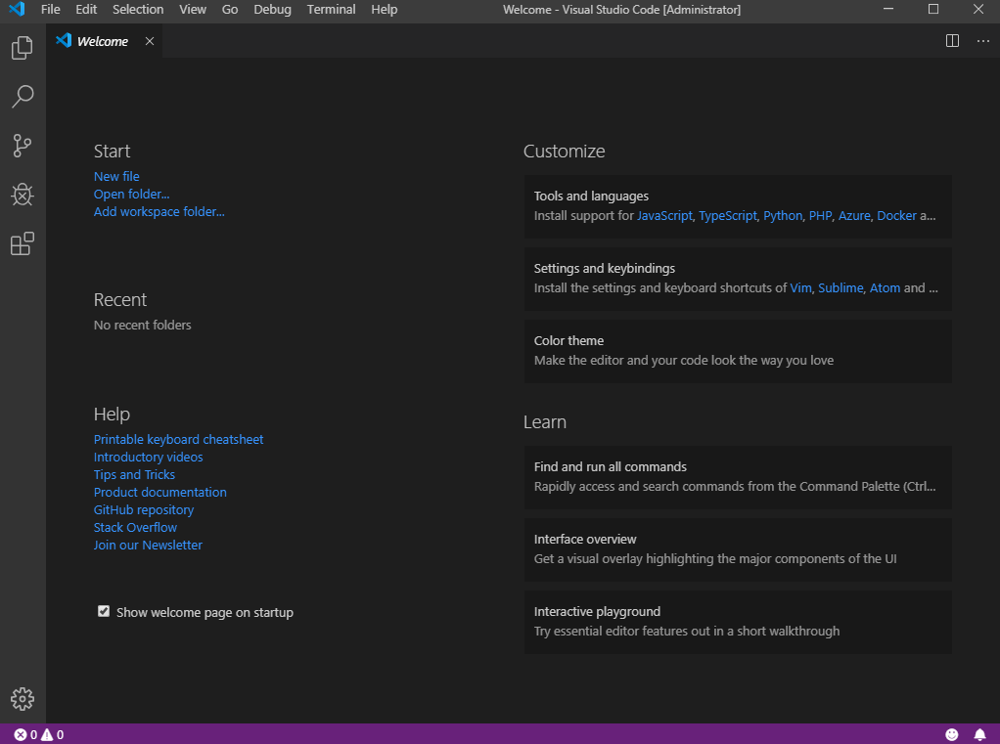
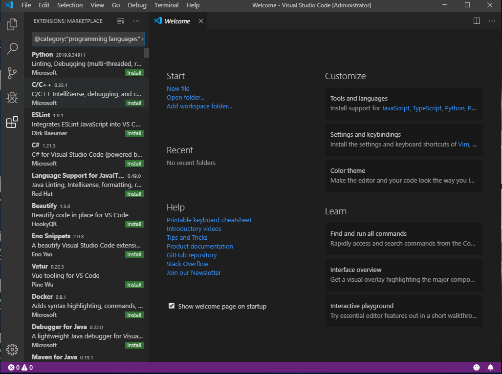
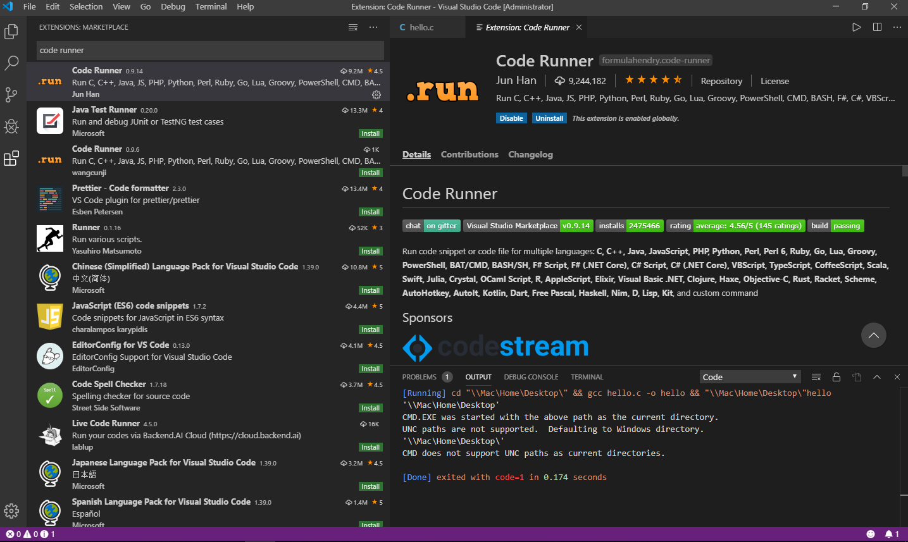
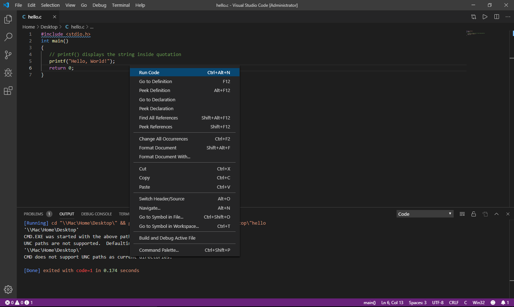
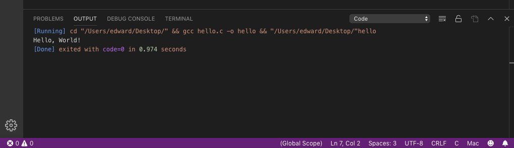

# 怎样安装Visual Studio Code 和 C/C++

1. 下载并安装 Visual Studio Code: https://code.visualstudio.com/

2. 点击Customize



3. 安装C/C++插件




4. 安装Code Runner 插件




5. 尝试跑一个 "Hello world!" 程序，比如

```c
#include <stdio.h>
int main()
{
   // printf() displays the string inside quotation
   printf("Hello, World!");
   return 0;
}
```






如果出现错误，提示无法找到gcc命令，则需要下载C/C++的编译器(compiler)。具体方法如下：


6. 下载并安装 MinGW
http://mingw-w64.org/doku.php/download/mingw-builds

* **一定要确保安装86_64x版本的**
* **安装路径要在根目录下，最好在 C:\ 目录下**

7. 更改环境变量：

安装好MinGW后，找到bin这个文件夹，复制这个文件夹的路径，比如：
C:\mingw_w64\\...\bin

8. 搜索 “环境变量”， 或者英文 "environ"


9. 点击“环境变量”


10. 点击 “Path”，然后 “编辑”


11. "新建"一个路径，然后黏贴上之前复制好的bin的路径


一路点“确认”关闭窗口。再试一遍运行程序。
