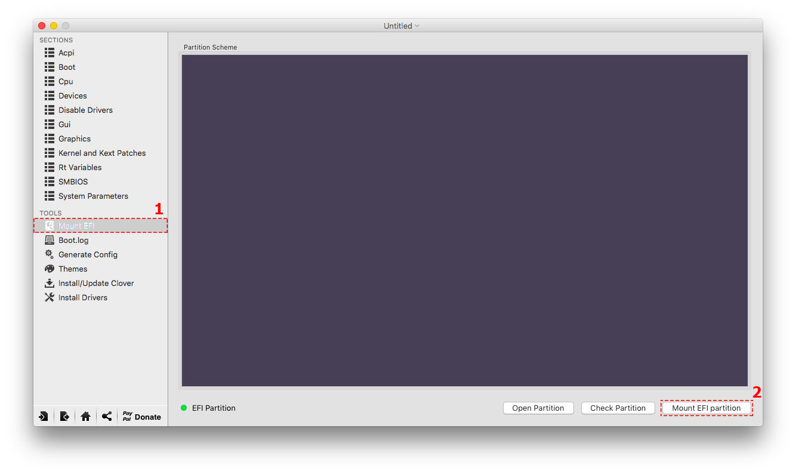

# How to Install macOS Sierra Final on VirtualBox on Windows
 [***Written by Techsviewer***](https://techsviewer.com/install-macos-sierra-virtualbox-windows/)

 

 Apple has announced the Mac OS Sierra as the next version of Mac system software. During its presentation that took place at the WWDC 2016 conference, the new macOS sierra was versioned as Mac OS X 10.12 and will be accessible as a free copy for all compatible Macs. The Mac OS 10.12 final comes with a lot of amazing features. One major feature is the debut that Siri makes on the Mac. Siri has been designed with new capabilities for the Mac desktop. This is the only way to make the Mac desktop a smart device. Now, You can install macOS Sierra on Windows.

 VirtualBox is capable of installing an macOS in your computer as an application. it works perfectly well with Sierra and in order to run macOS on windows, you need a computer with windows that has to be 64-bit, at least 4GB RAM and a dual-core processor. Installing macOS Sierra in VitualBox is very easy; you download virtual disk and open it with VirtualBox, then create new virtual machine. Here are the steps to install macOS Sierra on VirtualBox on Windows.

 Latest preview: 10.12 Final (16A323). September 20, 2016
 Download Image:
 Google Drive (One Full): https://goo.gl/OKgCeH
 Google Drive (5 of 5): https://goo.gl/DZTaKi
 Fix Download Limit: https://techsviewer.com/fix-download-limit

## Steps to Use macOS 10.12 Sierra on VirtualBox on Windows

### Step 1: Extract Image File with Winrar or 7zip
Install Winrar, Select Image file, Right click then select “Extract Here”


### Step 2: Install VirtualBox
This tutorial working with VirtualBox 5.0.


### Step 3: Create New Virtual Machine
Name: macOS 10.12 Sierra
Type: Mac OS X
Version: Mac OS X 10.11 El Capitan (64 bit) or 10.12 Sierra
Memory size is 4 GB( 70% of your Ram)
Virtual disk file: macOS 10.12 Sierra.vmdk


### Step 4: Edit Your Virtual Machine
**CPU**: 2 CPU (my CPU is core i3) and Enable PAE/NX


**System**: Enable EFI, Disable Floppy, Chipset is PIIX3 or IHC9


**Graphics**: Set 128 vRam


**Storage**: macOS 10.12 Sierra.vmdk


### Step 5: Add Code to VirtualBox with Command Prompt (cmd)

**Make sure to completely close VirtualBox**

**Replace** “Your VM Name” with your virtual machine name then Copy – Paste to Command Prompt

**Code for Virtualbox 5.x.x:**
```
cd "C:\Program Files\Oracle\VirtualBox\"
VBoxManage.exe modifyvm "Your VM Name" --cpuidset 00000001 000106e5 00100800 0098e3fd bfebfbff
VBoxManage setextradata "Your VM Name" "VBoxInternal/Devices/efi/0/Config/DmiSystemProduct" "iMac11,3"
VBoxManage setextradata "Your VM Name" "VBoxInternal/Devices/efi/0/Config/DmiSystemVersion" "1.0"
VBoxManage setextradata "Your VM Name" "VBoxInternal/Devices/efi/0/Config/DmiBoardProduct" "Iloveapple"
VBoxManage setextradata "Your VM Name" "VBoxInternal/Devices/smc/0/Config/DeviceKey" "ourhardworkbythesewordsguardedpleasedontsteal(c)AppleComputerInc"
VBoxManage setextradata "Your VM Name" "VBoxInternal/Devices/smc/0/Config/GetKeyFromRealSMC" 1
```

**Code for Virtualbox 4.x.x:**
```
cd "C:\Program Files\Oracle\VirtualBox\"
VBoxManage.exe modifyvm "Your VM Name" --cpuidset 00000001 000306a9 04100800 7fbae3ff bfebfbff
VBoxManage setextradata "Your VM Name" "VBoxInternal/Devices/efi/0/Config/DmiSystemProduct" "MacBookPro11,3"
VBoxManage setextradata "Your VM Name" "VBoxInternal/Devices/efi/0/Config/DmiSystemVersion" "1.0"
VBoxManage setextradata "Your VM Name" "VBoxInternal/Devices/efi/0/Config/DmiBoardProduct" "Iloveapple"
VBoxManage setextradata "Your VM Name" "VBoxInternal/Devices/smc/0/Config/DeviceKey" "ourhardworkbythesewordsguardedpleasedontsteal(c)AppleComputerInc"
VBoxManage setextradata "Your VM Name" "VBoxInternal/Devices/smc/0/Config/GetKeyFromRealSMC" 1
```

### Step 6: Tuning display resolution

**Keep the VirtualBox closed and continue with the comamnd prompt with administrative priviledge**

In the command prompt, type in
```
VBoxManage setextradata “Your VM Name” VBoxInternal2/EfiGopMode N
```
Where N can be one of 0, 1, 2, 3, 4, 5 referring to the 640×480, 800×600, 1024×768, 1280×1024, 1440×900, 1920×1200 screen resolution respectively.

This way may not allow other resolution ratios such as 1920x1080. To enable custom resolutions, use Clover bootloader. See the second part of this document for more details.


## Done! Run Your Virtual Machine:


# How to Edit Bootloader on VMware or VirtualBox with Clover
[***Written by Techsviewer***](https://techsviewer.com/how-to-edit-bootloader-on-vmware-or-virtualbox-with-clover/)
**What is Clover?**

Clover is an open source EFI bootloader that was developed two years ago by developers based at Project OS X. The group of developers was led by Slice; they were trying to come up with something that will solve inherent in existing OSX installation methods that is based on legacy boot leaders.

The other problems that Clover aims to solve are boots trouble desktop and laptop, use of native OSX installation media, ability to patch DSDT, create OS X recovery partition, solve multi boot issues and solve traditional boot loader.

Clover comes with complete different configuration system that offers a steep learning curve, so you should be careful not to confuse it with the traditional chameleon or chimera; because, clover is presented in beta, it is very hard to guarantee that it can work with all system.

However, developments have been fast tracked at the code level and it is really hard to pin down clover on any design that you can think of. Although the recent development in the system has made it easy to use and they have actually made it more reliable to be used with people who feel they are willing to learn new things.

**What is Clover Configuration?**

Clover Configuration is specifically designed to help you customize the manner in which EFI or Legacy bootloader works. This makes clover a simple system but very essential software solution that can generate personalized configured files.

As soon as you launch the system, it will run automatically to check if there are any configured files. In the process it will enable you to view the files. It can also run to check if there is an updated version of clover EFI and then download it to the bootloader.

Clover Configuration application is put into two main functions, and it also gives you the option to use the available tools to perform other certain tasks such as customizing it into particular parameters.

## Steps to Edit Bootloader on VMware or VirtualBox with Clover

### Step 1: Mount EFI with Clover Configuration
If this is a OSX virtual machine, transfer the Clover_x_x_x.pkg file onto the OSX virtual machine to perform the following steps.
Open Clover then select “Mount EFI” and click Mount EFI Partition


### Step 2: Open Config.plist File in EFI Partition
This is EFI Partition:cd d:

Open EFI/Clover/Config.plist file:


### Step 3: Edit Your Config File with Clover Configuration
Open SMBIOS then select your system.


Click **“Shake”** to complete. Done, You can save this file (click **File – Save**).
