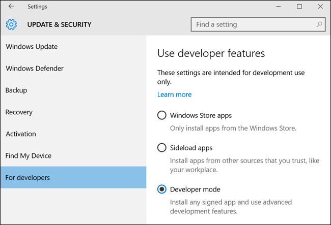

# How to run GUI via Windows 10 Ubuntu subsystem bash

*** The goal of this is to run a GUI program launched from Windows 10 Ubuntu subsystem. ***

* Step 1: Install Ubuntu subsystem in Windows 10
  - Go to `Settings--> Update & Security --> For Developers`. Select `Developer mode`
  
  - Go to `Control Panel --> Programs --> Turn Windows Features On or Off`. Check `Windows Subsystem for Linux (Beta)`
  
  - Once installed, reboot the system.
* Stpe 2: Install Xming or X11 in Windows
* Step 3: Launch GUI program
  - Use `sudo apt-get install` to install a program. For instance
  `sudo apt-get install firefox`
  - Once a GUI program, e.g., firefox, is installed, **make sure Xming is running in Windows as a background**
  - In the bash console, do `DISPLAY=:0 firefox` to launch the program at display number 0.
* Troubleshooting:
  - For programs like Spyder, a Python IDE that requires Qt, we may get error messages that cannot load `libGL.so.1`.
    - Install apt-file: `sudo apt-get install apt-file`
    - Update the list: `sudo apt-file update`
    - Search the file: `apt-file search libGL.so.1`
    - This will output a list of modules that may contain the searched file but not yet installed. Carefully examine each module for system and hardware requirements.
    - On my computer (MSI GhostPro GS60 006 with NVIDIA GTX 970M laptop), I installed `libGL1-mesa-glx` to enable Spyder to launch.
