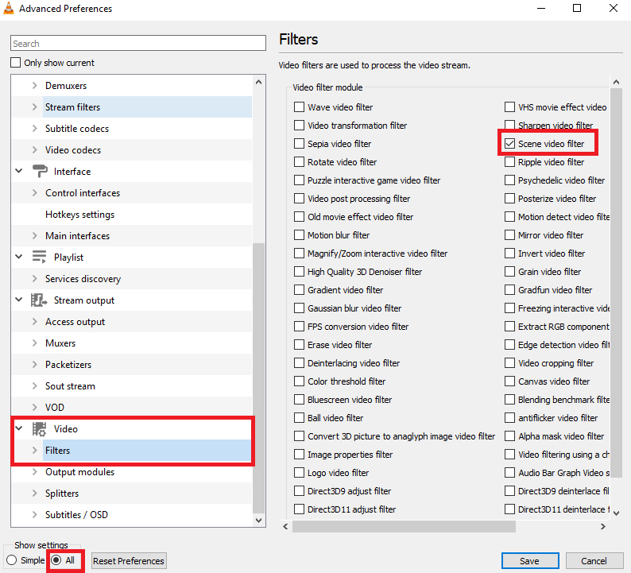
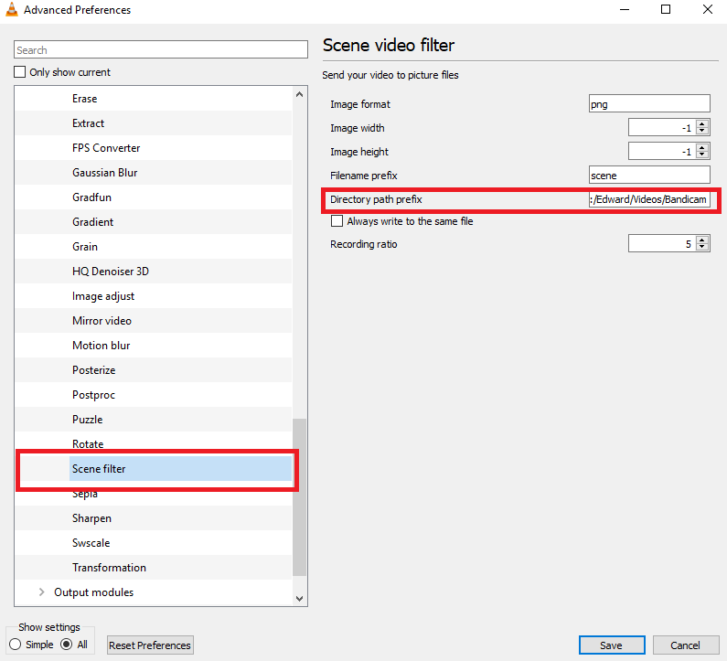

# A brief description of converting videos into frames using VLC
1. Run VLC as administrator
2. Preferences (Ctrl + P) --> Show Settings (All)
3. Under Video --> Filters, select "Scene video filter"

4. Expand "Filters", and under "Scene video filter":
  * specify the output directory of the output images. Make sure to use forward slash "/"
  * specify the "Recording ratio": 5 means 1 frame will be saved for every 5 frames played

5. Open the video and play through the video
6. Change the settings back after conversion

# Convert from frames to GIF using GIMP
1. Open GIMP
2. Import the sequence of images as Layers: File --> Open as Layers
3. Preprocess the images the way we wanted, whether that being resampling or cropping
4. Reduce the size of the GIF image: Filters --> Animations --> Optimize (for GIF)
4. Export the image as GIF
5. If the generated file is too large, try some online GIF compression tools, such as http://gifcompressor.com/
