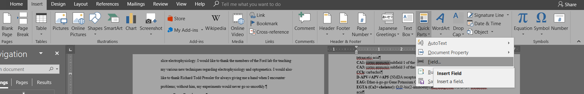

# Windows Command #

## CLI ##
** Get a list of drives **
```
wmic logicaldisk get caption, description, drivetype, name, volumename, providername
```

** Set file association **
```
assoc .txt="%USERPROFILE%\Local\AppData\atom\bin\atom.cmd"
```

** Display file association **
```
assoc .txt
```

## PowerShell ##

**Get a list of serial port devices**
```
Get-WMIObject Win32_SerialPort
```

## Remove arrows on shortcut ##

1. Press the `Windows + R` keys to open the `Run` dialog, type `regedit`, and press `Enter`.

2. In `regedit`, navigate to the location below:
NOTE: If `Shell Icons` it is not in the left pane under `Explorer`, right click on `Explorer`, and click on `New` and `Key`. Type `Shell Icons` for the new keys's name, and press `Enter`.

  ```
  HKEY_LOCAL_MACHINE\SOFTWARE\Microsoft\Windows\CurrentVersion\Explorer\Shell Icons
  ```

3. In the right pane of `Shell Icons`, right click on an empty area, and click/tap on `New` and `String Value`, and name it `29`.

4. Double click/tap on the `29` string value to modify it.

5. Type in the full path of your custom `.ico` file within quotes, *OR* copy and paste the path below for what overlay icon you would like to use, and click/tap on `OK`.

  ```
  * (No arrow - Transparent, leave as empty)

  * (Classic) %windir%\System32\shell32.dll,-30

  * (Default) %windir%\System32\shell32.dll,-16769
  ```

6. Log off and on, or restart the computer to apply.

## Remove "shortcut" appendix when creating new shortcut ##
1. Press the `Windows + R` keys to open the Run dialog, type `regedit`, and press `Enter`.

2. If prompted by `UAC`, click/tap on `Yes`.

3. In the registry, go to:
  ```
  HKEY_CURRENT_USER\Software\Microsoft\Windows\CurrentVersion\Explorer
  ```
4. In the right pane of `Explorer`, double click/tap on `link` to modify it.

5. To Remove the Shortcut Extension
A) Change the value to `00 00 00 00` and click/tap on `OK`, and go to step 7 below.
NOTE: To change the value, press the `Delete` (`Del`) key once and type `00`.
B) Go to step 7.

6. To Restore the Shortcut Extension
NOTE: This is the default setting.
A) Change the value to `1E 00 00 00` and click/tap on `OK`, and go to step 7 below.
NOTE: To change the value, press the `Delete` (`Del`) key once and type `1E`.

7. Close `regedit`.

8. Log off and log on, or restart the computer to apply changes.

## Enable network drives to be shared across users ##
1. Open `RegEdit`
2. Go to `HKLM\SOFTWARE\Microsoft\Windows\CurrentVersion\Policies\System`
3. Create a `DWORD` value named `EnableLinkedConnections` and set it to `1`
4. Reboot the computer
5. Test again

## Integrating Cygwin with Windows Comamnd Prompt ##
1. Control Panel --> System --> Advanced System Settings --> Environment Variables
2. Under `Advanced` tab, click on `Environment Variables`
3. Under `System variables`, check if a variable named `CYGWIN` exits. If not, create one, set value to `C:\Cygwin64\bin` or whereever Cygwin is installed
4. Then, edit `Path` variable. Prepend the path of Cygwin to the `Path` variable

## Necessary pacakges for cygwin
1. procps: `top`
2. `rysnc`
3. `ssh`
4. ncurses: `clear`
5. `nano`

## Windows 7 is not genuine, although Windows is really genuine, bug
In Command Prompt

`SLMGR -REARM`

retart the computer


## Add Registry key
1. Display the help document for `REG ADD` for full command usage
2. `REG ADD HKLM\SOFTWARE\Microsoft\HTMLHelp\1.x\ItssRestrictions /f /v MaxAllowedZone /t REG_DWORD /d 00000001`

Adds a key named `MaxAllowedZone` under `HKEY_LOCAL_MACHINE\...\ItssResitrctions` (add the folder if missing), with type `REG_DWORD` and value `00000001`

## Query Registry Key
`REG QUERY HKCR /f VLC.`

Query `VLC.*`` under `HKEY_CURRENT_ROOT`

## Rebuild Windows icon cache
Create a directory junction link to the folder to be synchronized in the Dropbox folder
```
cd /d %userprofile%\AppData\Local
attrib –h IconCache.db
del IconCache.db
start explorer
```

## Dropbox: sync a folder outside of Dropbox folder
```
MKLINK /J \Link\To\Dropbox\Folder \Directory\To\Source
```

## Allow Inkscape to import EPS file.

Install Ghostscript, then add the path of Ghostscript to `PATH` environment variable
```
;C:\Program Files\gs\gs9.07\lib;C:\Program Files\gs\gs9.07\bin
```

Execute the following command in an administrative cmd
```
if %GS%/==/ set GS=gswin64
if %GSC%/==/ set GSC=gswin64c
```
Restart Inkscape.

## Fix `Video not available, cannot find 'VIDS:IV50'decompressor` error
1. Open a "Command Prompt" as Administrator
2. type command `cd C:/Windows/SysWOW64`
3. type command `regsvr32 ir50_32.dll`


## MS Word: 2 tables of contents
1. Select the text to add table of contents for
2. Press Alt + Shift + O. This will open "Mark Table of Contents Entry" diaglog
3. Select a "Table identifier", a letter ranging from A-Z
4. Select the level of this entry
5. Click "Mark". This will insert a "TC" field after the selected text. Move this "TC" field before the text.
6. Repeat 1-5 for all entries.


7. In the page of new table of contents, click "Insert", and in the "Text" ribbon group, select "Quick Parts", then "Fields".

8. In the "Field" dialog, under "Field names" list, click "TOC", then below the list, click on "Field Codes", then "Options", which will open "Field Options" dialog. Under "Field codes: TOC [Switches]", type in `\f Z \h`, where `Z` is the identifier that we selected in 3. `\h` enables the hyperlink. Click "OK" to insert the new table of contents.

